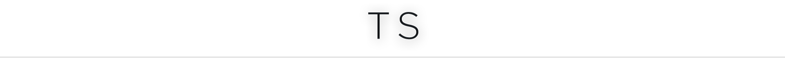

<a href="#top" id="top">
  
</a>
<p align="center">
  <a href="https://www.npmjs.com/package/@darkobits/ts"></a>
  <a href="https://travis-ci.com/github/darkobits/ts"></a>
  <a href="https://libraries.io/npm/@darkobits%2Fts"></a>
  <a href="https://github.com/conventional-changelog/standard-version"></a>
</p>


## Install

```
npm install --save-dev @darkobits/ts
```

# Use

<p align="center">
🚧
</p>
